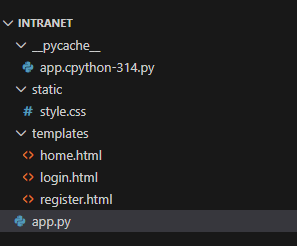

# WAE

## **Intranet**

**Gure intraneta login eta erregistro sistema bat edukiko du database batean pasahitzak enkriptatuz. Gainera loginak denbora zehatz batean mantenduko dira eta GLPI intzidentzia serbitzuaren esteka egongo da. Hauek izan dira egin behar dugun pausoak.**&#x20;


Lehendabizi python intalatu dugu web ofizialaean; gure kasuan 25.0 bertsioa

Intranet ditutako karpeta batean behar izan diren, python eta html kodeak sortu ditugu


<figure><figcaption></figcaption></figure>

<figure><figcaption></figcaption></figure>

<figure><figcaption></figcaption></figure>

<figure><figcaption></figcaption></figure>

Hau izango litzake intraneta;

<figure><figcaption></figcaption></figure>

Datubasean gainera pasahitzak enkripatuta daude eta denbora errealean gordeko dira erregistratzean

<figure><figcaption></figcaption></figure>

GLPI zebitzaria ubuntu server makina birtual batean instalatu da eta ip bidez funtzionatzen du.192.168.71.109


Gure intraneta 192.168.71.106 ip-a du eta 8080 portuan dago


erregistroa mantentzeko; honako teknika erabili dugu

```python
app.permanent_session_lifetime = timedelta(days=1) 
```

```python
```
